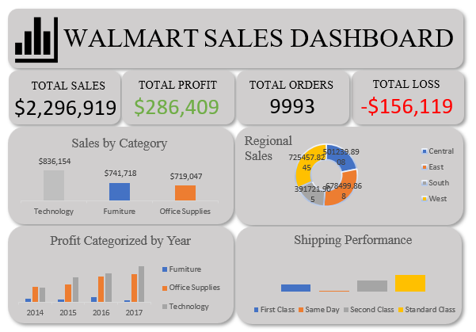

# Walmart-sales-data-analysis
Analysis of walmart sales dataset using Excel and presenting insights using PowerPoint
# Excel Data Analysis project. 
You have been presented with a sales Data for WALMART, A grocery store having branches across United States of America. 
## The store owner would like to know the following
1. What product category generated the highest income
2. How many days on average does it take to ship our product to customers
3. Who are our top 10 Highest paying customers. 4. Which state generated the highest profit and what state generated the lowest
4. Show us our sales trend from 2014 to 2017, we want to compare for each year
5. What region generated the highest profit
6. Which of the consumer segments has the most profit
7. Present your answer in a power point slide
8. Explain your insights and give us recommendations on what you observed
# Preparing the Data
1. Removed Duplicates.
2. Filled in empty cells
3. Created 2 new columns for shipping year and shipping days respectively.
4. Cleaned and Prepared Data https://github.com/Pristine45/walmart-sales-data-analysis/blob/main/WALMARTs.xlsx.
# Analysis
1. Created Summaries of the Data based on the objectives of the project using Pivot tables.
2. Created a Dashboard using the summarized data from the pivot tables and ojective of the project.
3. 
# Insights
1. Technology is the highest revenue-generating category, indicating strong customer demand and premium pricing potential.
2. Average delivery time is 3.96 days, showing moderate operational efficiency with room for optimization.
3. Revenue is a bit concentrated among the Top 10 customers, highlighting dependency on high-value buyers.
4. Indiana is the most profitable state ($18,382.94), while Ohio is generating significant losses (-$16,959), showing geographic imbalance.
5. Sales experienced steady growth from 2014 to 2017, reflecting scalable and expanding business model.
6. The West region leads in profitability, indicating stronger market performance and operational efficiency.
7. The Consumer segment generates the highest profit, outperforming Corporate and Home Office segments.
## Overall:
The business is growing steadily with strong category and regional performers, but profitability disparities across states present risk exposure.
# Recommendations
1. Expand Technology category investment through inventory scaling, bundling, and targeted promotions.
2. Improve delivery efficiency by optimizing logistics to reduce shipping time below 3.5 days.
3. Address Ohio’s losses through pricing review, cost reduction, and product mix analysis.
4. Replicate Indiana and West region strategies in underperforming states.
5. Strengthen retention of top 10 customers with loyalty programs and personalized engagement.
6. Focus growth strategy on the Consumer segment through digital marketing and customer experience enhancement.

## Tools Used Throughout The Process
1. Excel
2. PowerPoint
